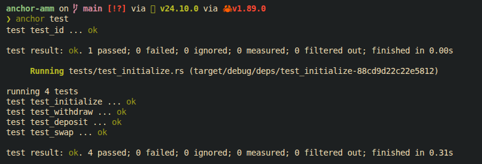

# AMM (Automated Market Maker) on Solana

A lightweight Automated Market Maker built on Solana using the Anchor framework, implementing core DeFi primitives: liquidity pools, swaps, and LP token accounting.

## Key Features
Constant-product AMM (x * y = k)
Liquidity pool creation with LP token minting
Deposit / Withdraw liquidity with proportional accounting
Token swaps with slippage protection
PDA-based pool authority and vault security model
Full local test coverage (Anchor + LiteSVM-compatible setup)

## Tech Stack
Rust (Solana Program)
Anchor Framework
Solana SPL Tokens
Local Validator / LiteSVM testing

## Architecture Summary

The AMM is built around a single liquidity pool:

Two token vaults hold reserves
LP tokens represent proportional ownership
All pricing derived from reserve balances
Pool state managed via Program Derived Addresses (PDAs)

Invariant:

x * y = k

### Core Instructions

#### Initialize Pool

Creates a new AMM pool and sets initial liquidity.

- Establishes vaults
- Initializes LP mint
- Sets pool state PDA
---

#### Deposit Liquidity

Adds assets to the pool and mints LP tokens.

- Transfers tokens into vaults
- Mints LP tokens proportional to contribution
- Updates reserve state
---

#### Withdraw Liquidity

- Redeems LP tokens for underlying assets.

- Burns LP tokens
- Calculates proportional share
- Returns pool assets to user
---

#### Swap Tokens

- Executes token exchange between vaults.
- Uses constant-product pricing
- Enforces slippage limits
- Updates reserves atomically

### Testing Strategy

Fully tested using Anchor’s local environment (LiteSVM-compatible) . Coverage Includes:
- Pool initialization correctness
- Deposit/withdraw proportionality
- Swap correctness and reserve updates
- Slippage protection enforcement
- LP supply consistency

#### Run Tests

```sh
anchor test
```


### Typical Flow

- Initialize pool
- Add initial liquidity
- Perform swaps
- Add/remove liquidity dynamically
- Validate pool invariant consistency

### Design Highlights
1. Deterministic State Model

All pool state is derived from controlled vault interactions and PDA ownership.

2. Safe Token Accounting

All transfers use SPL token program CPI with strict account validation.

3. Slippage Protection

Swap instructions enforce minimum output constraints to prevent adverse execution.

4. LP Token Model

Liquidity providers receive fungible LP tokens representing pool ownership share.

---

This implementation focuses on correctness, safety, and Solana-native design patterns rather than feature complexity.

It reflects real-world DeFi architecture principles in a minimal, auditable form.